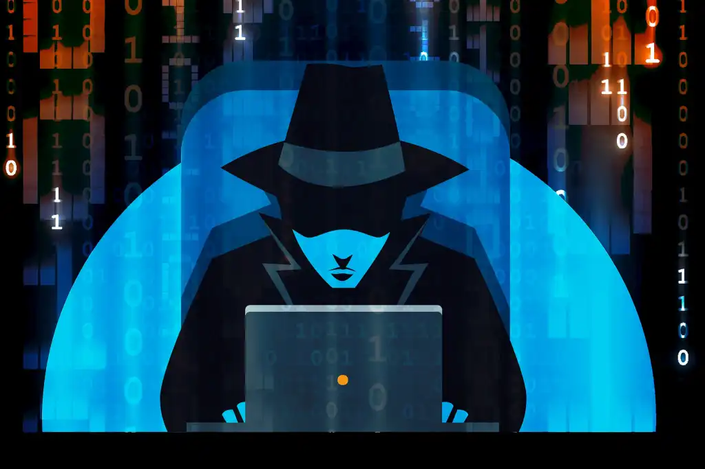

An easily accessible place to showcase my project portfolio and accomplishments to hiring managers as well as an easy way to keep track what I've worked on thus far.

# My Projects  

- [Home Lab](https://github.com/Kerasu/Home-Lab/blob/main/README.md)
- [SIEM Lab](https://github.com/Kerasu/SIEM-LAB)
- [Malware Analysis](https://github.com/Kerasu/Malware-Analysis)

## My progress on THM/HTB/etc

[My TryHackMe Profile](https://tryhackme.com/r/p/Kyou)

### Socials

[LinkedIN](https://www.linkedin.com/feed/)

### Small image

### Large image

